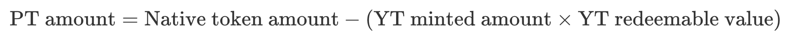
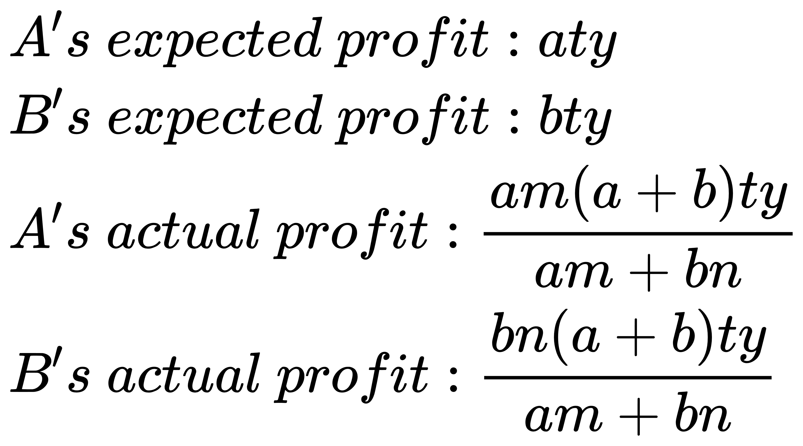
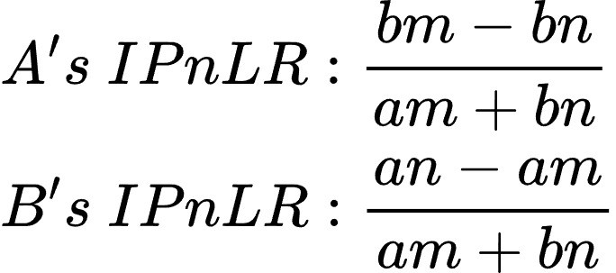
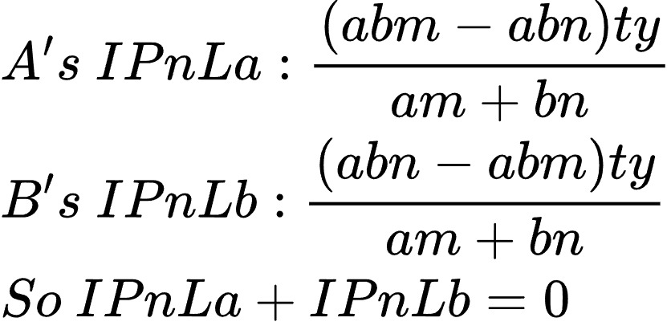

[Gitbook](https://outrun.gitbook.io/doc "Outrun Official Doc")  

**Read this in Chinese: [中文](README.cn.md)**  

# 🏦 Outstake -- Built entirely around native yields

_Not Only Native Yield Staking Protocol_  

**Outstake** is a protocol entirely built around native yield tokens, introducing the first non-USD stablecoin model tied to native yield rates. Compared to other yield token protocols in the market, such as **Pendle**, Outstake offers **greater flexibility, enhanced composability**, and provides **higher returns along with multiple sources of income**. The assets supported by Outstake form the foundational support for the Outrun ecosystem, providing a stable base for the entire system. Specifically, Outstake operates as follows:

+ **A New Staking Model Based on Native Yield Tokens**: Outstake adopts a unique design that allows users to control the native yield generated by their assets. Through Outstake, users can mint Principal Tokens **(PT)** by staking their assets, thereby unlocking liquidity for their staked assets and utilizing these tokens across a range of DeFi applications.

+ **Native Yield Stablecoin (also YT)**: The value of the native yield stablecoin is directly tied to the native yield rate. The economic model built around it offers stakers higher income and multiple sources of revenue. It is highly composable, allowing developers to create new products around it, thereby enriching the Outrun ecosystem.

+ **Position Option Tokens**: These option tokens represent the right to redeem the native yield token at the end of its lock-up period. This option allows users to trade for a fixed interest rate without trading the **PT** itself, thereby enhancing capital efficiency.

## Stake Rebase Native Yield Tokens

**Rebase native yield tokens** refer to native yield tokens that require manual claim of the yield or automatically rebase, such as **Blast ETH** and **Lido stETH**.

When staking **Rebase native yield tokens**, the Outrun ecosystem mints three types of ERC20 tokens:

* **Wrapped Token (WT):** A wrapper token for the **Rebase native yield tokens**.
* **Principal Token (PT):** Can be burned upon maturity to redeem the full amount of staked WT.
* **Yield Token (YT):** Pegged to the native yield rate of the native yield token and can be redeemed at any time.

### Wrapped Token (WT)

**WT** is a stablecoin pegged to **Rebase native yield tokens**, obtainable through a 1:1 wrapping mechanism.

Thus, 1 **WT** always represents 1 **Rebase native yield token**, and the circulating supply of **WT** matches the amount of its corresponding **Rebase native yield tokens**. Users can convert **WT** back into **Rebase native yield tokens** at any time. Holding **WT** alone does not yield the staking rewards; it should be viewed as an analogous holding of **Rebase native yield tokens**.

In **Blast L2**, **orETH (WT)** will also serve as **Wrapped ETH** in Outswap.

### Principal Token (PT)

**PT** is a staking principal token minted by staking **WT**, aimed at unlocking the liquidity of staked tokens.

When users stake **WT**, they need to specify a lock-up period to mint **PT** and **YT**. The quantity of **PT** minted is not on a 1:1 basis with the staked **WT** but is related to the **staking duration or the number of YT minted**. The quantity of **Rebase native yield token** equals the amount of **native tokens convertible** (Native token amount). The specific algorithm is:

  

**YT Redeemable Value:** The native yield that can be redeemed by burning one **YT**.

Over time, the vault continuously generates native staking yields, and a corresponding amount of **WT** is minted and added to the **YieldPool**, which increases the redeemable value of **YT**. The **PT** minted from newly staked **WT** will slightly decrease, but regardless of the number of **PT** minted, users will be able to redeem their staked **WT** completely by burning the **PT** minted at the end of the lock-up period.

## Staking Non-Rebase Native Yield Tokens

**Non-Rebase native yield tokens** have their native yield built into the tokens themselves. Burning **Non-Rebase native yield tokens** allows for the redemption of both the principal and the native yield. Examples include **slisBNB (Lista)** and **STONE (Stakestone).**

For staking **Non-Rebase native yield tokens**, the Outrun ecosystem mints two types of ERC20 tokens:

* **Principal Token (PT):** Upon maturity, PT can be burned to redeem the principal portion of the staked **Non-Rebase native yield tokens**.
* **Yield Token (YT):** Pegged to the native yield rate of the native yield token and can be redeemed at any time.

### Principal Token (PT)

**PT** is obtained by staking **Non-Rebase native yield tokens** and specifying a lock-up period.

For **Non-Rebase native yield tokens**, the quantity of **PT** is not minted on a 1:1 basis with the staked **Non-Rebase native yield tokens** but is related to the staking duration (number of **YT** minted) and the redemption ratio of the **Non-Rebase native yield token** relative to the native token. In simple terms, first convert the amount of **Non-Rebase native yield tokens** to the corresponding amount of native tokens, and then use the following algorithm to calculate:

  

**YT Redeemable Value:** The native yield that can be redeemed by burning one **YT**.

It is important to note that while the quantity of **Non-Rebase native yield tokens** staked does not change upon maturity, their value (relative to the redemption ratio of native tokens) increases with the accumulation of native yield. Therefore, burning **PT** will not redeem the same amount of **Non-Rebase native yield tokens** as initially staked but will be slightly reduced, as part of the value is attributed to **YT**.

## Yield Token (YT)

**YT** represents the right to the yield of staked **native yield tokens**, obtained by staking **native yield tokens** and specifying a lock-up period. **YT** separates the native yield from the **native yield tokens**, allowing it to be traded on secondary markets and used to build other DeFi Lego components.

### **A true universal fungible YieldToken**

Unlike YieldTokens from other protocols in the market, which are either NFTs or special FTs (e.g., Pendle), **these are non-fungible**. This characteristic leads to a **lack of liquidity** for YieldTokens and **reduces the composability** of the protocol.

Outrun's **YT** is a **genuinely fungible token** **(FT),** offering **excellent liquidity and strong composability**. For every 1 **native yield token** staked for 1 day, 1 **YT** is minted. If 𝑥 **native yield tokens** is staked for 𝑦 days, 𝑥𝑦 **YT** will be minted. Therefore, theoretically, 1 **YT** is anchored to the native yield generated by staking 1 **native yield token**for 1 day.

**YT** can be freely traded and can be instantly destroyed and redeemed for the accumulated native yield in the **YieldPool** without restrictions. When destroyed, the native yield generated is redeemed proportionally based on the number of **YT** destroyed compared to the total **YT** supply.

### The Stability Mechanism of **YT**

**YT** is also a **non-USD algorithmic stablecoin** pegged to the **native yield rate**. Theoretically, one **YT** represents the native yield produced by one **native yield token** over one day. Since **YT** is linked to the **native yield rate** and minted through the staking of **native yield tokens**, it differs from early algorithmic stablecoins like **Luna**. The value system of **YT** is a closed system, ensuring that **a price death spiral will never occur**.

Initially, the redeemable value of **YT** (the native yield that can be redeemed by destroying **YT** ) will gradually increase over time from the point when the first **YT** is minted, theoretically ceasing to grow once it reaches its theoretical value cap. Burning **YT** will redeem native yield proportionally, so it does not affect its redeemable value. The redeemable value of **YT** will only decrease **when new YT** **is minted**, and the decrease will be **reaccumulated** in the future (due to the staking of new **native yield tokens**).

However, in practice, some users may burn **YT** before the lock-up period of their staked **native yield token** expires, leading to a reduction in **YT**’s circulation while native yield continues to accumulate in the **YieldPool**. This can eventually cause **YT**’s **redeemable value to exceed its theoretical value cap**, resulting in two possible outcomes:

1. **Arbitrage Opportunities:** When the market price of **PT** is higher than the native yield token, users can stake more **native yield tokens** to mint new **YT** and immediately burn them to complete the arbitrage. However, this will provide more fuel for the next value breakthrough.
2. **Increased Yield for Long-Term Stakers:** As **YT** can redeem more yield, long-term stakers benefit from higher returns. Additionally, influenced by arbitrageurs, the market price of **PT** may slightly decrease (But the circulation of **PT** is already lower than the staked amount and is influenced by **FFLaunch** and **Memeverse**).

Thus, the process of **YT**’s redeemable value surpassing its theoretical value ceiling will **continually recur**, creating a **growth flywheel** and attracting **more staking volume**. The economic model built around **YT** will bring additional opportunities to the Outrun ecosystem.

### Broader prospects

**YT** is not only a tool for helping long-term stakers earn more yield but also a **truly fungible, universal yield token**. Additionally, it represents Web3's first **decentralized algorithmic stablecoin** anchored to **native yield rates**. In the competitive market, **YT** remains connected to these **native yield rates**. Looking ahead, Outrun will utilize **YT**’s unique features and community to develop even more **innovative products**.

### The mathematical model of YT

While **YT** may appear simple on the surface, the ability for **YT** to be freely traded and for any **YT** holder to redeem native yields at any time introduces a highly complex game-theoretic process and mathematical model.

The following, we construct a **minimal model** to calculate impermanent profit and losses.

Assuming that the accumulated native yield in the YieldPool is 0, and 1 YT is pegged to the yield produced by 1 native yield token over 1 day, which we denote as _**y**_.

User A stakes **𝑎** native yield tokens and locks them for **𝑚** days, which will mint **𝑎𝑚** YTs. We will consider other users as a collective entity, referred to as User B, who stakes **𝑏** native yield tokens and locks them for **𝑛** days, which will mint **𝑏𝑛** YTs.

After **𝑡** days:

  

The **Impermanent Profit and Loss Ratio (**_**IPnLR**_**)** can be obtained by dividing the actual earnings by the expected earnings and then subtracting 1.\
_**IPnLR = (Actual Earnings / Expected Earnings) - 1**_

  

The **impermanent profit and loss** **(**_**IPnL**_**)** can be obtained by multiplying each user's **impermanent profit and loss ratio** **(**_**IPnLR**_**)** by their respective expected earnings.\
_**IPnLa = IPnLRa \* Expected Profit\_A**_\
_**IPnLb = IPnLRb \* Expected Profit\_B**_

  

From the above figure, we can deduce that there is an impermanent profit and loss conservation between User _A_ and User _B_. If User _A_ and User _B_ lock up their assets for the same duration, both parties would experience no impermanent profit or loss. In other words, an individual user's impermanent profit and loss are correlated with the weighted average duration of other users in the staking pool.

Of course, the above is just a minimal model. The actual situation will be more complex due to the influence of multiple players in the game. Therefore, we will set a maximum lock-up time limit -- _**MaxLockInterval**_. The closer the user's lock-up time is to _**MaxLockInterval**_, the smaller the _**IL**_ and the larger the _**IP**_. Additionally, users can reduce _**IL**_ and obtain more _**IP**_ by redeeming their principal immediately upon the expiration of the lock-up period and then staking to mint REY again. When the user's lock-up time is _**MaxLockInterval**_, there will definitely be no _**IL**_.

Based on the model presented above, Outrun can help long-term stakers earn more income. We believe that ETH staking itself aims to make Ethereum more decentralized and secure. Therefore, users who contribute to the long-term protection of Ethereum should be rewarded more generously.

## Position Options Token

**Position Token** represents the token of a position. When users stake and lock native yield assets, they mint not only Principal Tokens **(PT)** and YieldTokens **(YT)** but also **Position Tokens** to represent their position.

Due to the tradable nature of **Position Tokens**, they can also be viewed as a type of option. This token represents the right to redeem native yield tokens at the end of the lock-up period, and we refer to it as the **Position Options Token**.

The **Position Options Token** allows holders, at the future date **when the position lock-up period expires**, to destroy a fixed number of PTs to redeem a fixed amount of native yield assets. It provides the right to **trade for a fixed interest rate** **without having to trade the PT itself**.

**Position Options Tokens** are supported by the **ERC1155** standard, which allows a single position to be split into multiple shares, enabling users to trade partial redemption rights of the position.

Additionally, holders of **Position Options Tokens** can choose to forcefully redeem their staked native assets early. To perform a forced early redemption, a number of **YTs** related to the early redemption time must be destroyed, and a small fee will be charged.

## The difference between Outstake and Pendle

Currently, Pendle is the most popular native yield staking protocol on the market. Here’s a comparison of Outstake and Pendle, highlighting the advantages of Outstake and the problems it addresses:

1. **Token Types and Composability**

* **Pendle:** The minted Principal Tokens **(PT)** and Yield Tokens **(YT)** have an expiration date. **PT** and **YT** are not standard ERC20 tokens but are closer to NFTs (Non-fungible tokens). This limits the composability and use cases of assets on Pendle. Especially **YT**, whose value drops to zero at expiration, further restricts its usage.
* **Outstake:** The minted **PT** and **YT** are standard ERC20 tokens without an expiration date, allowing them to be traded on any decentralized exchange **(DEX)** and freely integrated into other DeFi protocols. This design enhances composability and flexibility. Additionally, Outstake’s **YT** can be seen as a stablecoin tied to the yield rate, enabling users to take long or short positions on the yield rate.

2. **Fixed Rate Yields**

* **Pendle:** The number of **PT** minted equals the amount of staked tokens, and **PT** suffer from a negative premium that decreases over time. Fixed-rate yields come from the negative premium of **PT**, i.e., **the loss incurred by stakers**. To obtain a fixed rate, users must purchase the corresponding **PT**. Due to the negative premium, early selling of **PT** results in losses, significantly reducing their practical value and making it difficult to integrate **PT** into other DeFi strategies.
* **Outstake:** The number of **PT** minted is related to the amount of **YT** minted and the redeemable value of **YT**, avoiding the negative premium of **PT**. Outstake introduces tradable **Position Options Token (POT)**, representing the redemption rights of native yield tokens at the end of the lock-up period. This allows users to obtain fixed-rate rights without trading **PT**, improving capital efficiency. The yield comes from demand exchanges, not from staking losses.

3. **Staking Duration**

* **Pendle:** The staking duration is determined by the protocol, and users cannot freely choose the staking period.
* **Outstake:** Users can freely select the staking duration, controlling the amount of **PT**  minted. The staking duration is abstracted as **POT**, making the position expiration time a tradable asset, further increasing flexibility.

4. **Yield Sources**

* **Pendle:** Pendle does not generate real external yields; its fixed-rate yields essentially come from the losses of staking users. Previously, Pendle’s high fixed-rate yields were driven by airdrop incentives from various restaking protocols, leading users to bear losses in exchange for airdrop rewards, which were short-lived.
* **Outstake:** Through the Outrun ecosystem, which supports multiple assets, Outstake creates a rich arbitrage market and multiple income sources. Users can earn native yields, fixed-rate returns from trading **POT**, and numerous arbitrage opportunities based on Outstake assets, enhancing the overall profitability and scalability of the protocol.

## FlashLoan

FlashLoan is a new way of borrowing assets on the blockchain. Unlike traditional collateralized loans, FlashLoan requires no collateral, credit scoring, or management to process unsecured loans. FlashLoan is often used for on-chain arbitrage, liquidation, and other activities.

FlashLoan leverages atomicity to allow users to borrow without providing collateral. There are two important considerations to mention. Firstly, whenever you borrow assets in a FlashLoan, you must pay a usage fee. Secondly, the loan must be repaid in the same transaction it was borrowed.

Outrun offers FlashLoan functionality, where arbitrageurs can borrow the user's pledged ETH or USDB through the provided interface and repay it in the same transaction. This can provide additional sources of income for stakers and improve capital efficiency.

## Why choose Outstake?

1. **New Staking Model**

Outstake introduces a new staking model based on native yield tokens, allowing users to control the native yield generated by their assets.

Users can mint Staked Tokens to release liquidity for their staked assets and use them in various DeFi applications.

2. **Innovative Stablecoin Mechanism**

Outstake has designed a new algorithmic stablecoin tied to the yield rate, diverging from traditional USD-pegged stablecoins.

The economic model built around this stablecoin provides stakers with higher returns and multiple sources of income compared to traditional LSD protocols and yield token protocols.

3. **Powerful Composability**

The YT in Outrun offers high composability, allowing developers to build new products based on YT, thereby enriching the Outrun ecosystem.

4. **Position Options Token (POT)**

POT represents the redemption rights of native yield tokens at the end of the lock-up period. Through POT, users can trade for fixed-rate rights without directly trading PT itself, improving capital efficiency.

5. **Flash Loan Functionality**

Outstake offers flash loan functionality, providing stakers with higher yield potential from their native yield tokens.
